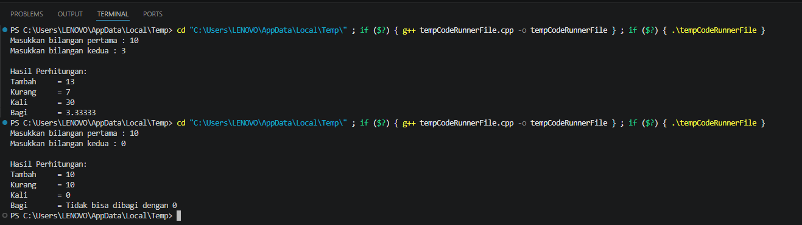
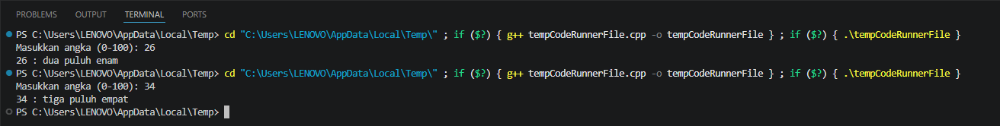
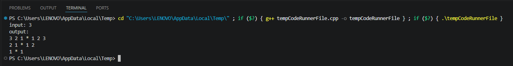

# <h1 align="center">Laporan Praktikum Modul 1 - Codeblocks IDE & Pengenalan Bahas C++ (Bagian Pertama)</h1>
<p align="center">Khairil Ikhsan Hasibuan - 109082500174</p>

## Dasar Teori

### A. Struktur Dasar dan Tipe Data pada Bahasa C++

C++ adalah salah satu bahasa pemrograman yang berasal dari pengembangan bahasa C. Dalam menjalankan sebuah program, C++ menggunakan fungsi `main()` sebagai bagian utama yang pertama kali dieksekusi, dan program juga dapat mempunyai fungsi tambahan sesuai dengan kebutuhan program.

#### 1. Identifier

Identifier adalah nama yang dipakai di bagian-bagian program, misalnya untuk memberikan nama pada variabel, konstanta, dan fungsi.

#### 2. Tipe Data

Tipe data dasar pada bahasa C++ digunakan untuk menentukan jenis data yang akan disimpan, beberapa tipe data tersebut meliputi bilangan bulat, bilangan real, karakter, dan `void`.

#### 3. Variabel dan Konstanta

Variabel digunakan untuk menyimpan nilai yang dapat berubah, sedangkan konstanta memiliki nilai yang tetap selama program dijalankan.

### B. Operator, Struktur Kondisional, dan Perulangan

Pada bahasa C++, operator digunakan untuk melakukan berbagai operasi pada data. Selain operator, terdapat juga struktur kondisional yang dipakai untuk menentukan jalannya program berdasarkan suatu kondisi. Untuk menjalankan perintah yang dilakukan berulang kali, C++ menyediakan beberapa jenis perulangan.

#### 1. Operator Aritmatika

Operator aritmatika digunakan untuk melakukan operasi hitung, seperti penjumlahan, pengurangan, perkalian, pembagian, dan sisa hasil bagi.

#### 2. Struktur Kondisional

Struktur kondisional seperti `if`, `if-else`, dan `switch` digunakan untuk menentukan perintah yang akan dijalankan sesuai dengan kondisi tertentu.

#### 3. Struktur Perulangan

Struktur perulangan seperti `for`, `while`, dan `do-while` digunakan untuk mengulang suatu perintah selama kondisi yang ditentukan masih terpenuhi.

## Guided 

### 1. Program Hello World & Input Output Dasar

```C++
#include <iostream>
using namespace std;

int main(){
    cout << "saya lagi belajar bahasa c++ nih!!!" << endl;
    return 0;
}

```
Program ini digunakan untuk menampilkan tulisan ke layar dengan menggunakan `cout`, tulisan yang tampil adalah "saya lagi belajar bahasa c++ nih!!!".

### 2. Menerima Input dan menampilkannya

```C++
#include <iostream>
using namespace std;

int main(){
    int inp;
    cin >> inp;
    cout << "nilai =" << inp;
    return 0;
}
```
Program menerima input dari user menggunakan `cin`, lalu menampilkan kelayar dengan `cout`.

### 3. Aritmatika dasar

```C++
#include <iostream>
using namespace std;

int main() {
    int W, X, Y; float Z;
    X = 7; Y = 3; W = 1;
    Z =(float) (X+Y) / (Y+W);
    cout<< "Nilai X = "<< Z << endl;
    return 0;
}
```
Program ini digunakan untuk melakukan perhitungan aritmatika sederhana dan menampilkan hasilnya kelayar.

## Unguided 

### 1. Buatlah program yang menerima input-an dua buah bilangan betipe float, kemudian memberikan output-an hasil penjumlahan, pengurangan, perkalian, dan pembagian dari dua bilangan tersebut.

```C++
#include <iostream>
using namespace std;

int main() {
    float bil1, bil2;

    cout << "Masukkan bilangan pertama : ";
    cin >> bil1;

    cout << "Masukkan bilangan kedua : ";
    cin >> bil2;

    cout << "\nHasil Perhitungan:" << endl;
    cout << "Tambah     = " << bil1 + bil2 << endl;
    cout << "Kurang     = " << bil1 - bil2 << endl;
    cout << "Kali       = " << bil1 * bil2 << endl;

    if (bil2 == 0) {
        cout << "Bagi       = Tidak bisa dibagi dengan 0" << endl;
    } else {
        cout << "Bagi       = " << bil1 / bil2 << endl;
    }

    return 0;
}
```
### Output Unguided 1 :

##### Output 1


Program ini menerima dua bilangan dari user, kemudian melakukan operasi hitung dan menampilkan hasilnya, pada bagian pembagian juga terdapat pengecekan agar bilangan tidak dibagi dengan nol.

### 2. Buatlah sebuah program yang menerima masukan angka dan mengeluarkan output nilai angka tersebut dalam bentuk tulisan. Angka yang akan di-input-kan user adalah bilangan bulat positif mulai dari 0 s.d 100.

```C++
#include <iostream>
#include <string>
using namespace std;

int main() {
    int angka;

    string angka_dasar[] = {
        "nol", "satu", "dua", "tiga", "empat",
        "lima", "enam", "tujuh", "delapan", "sembilan"
    };

    string angka_belasan[] = {
        "sepuluh", "sebelas", "dua belas", "tiga belas",
        "empat belas", "lima belas", "enam belas",
        "tujuh belas", "delapan belas", "sembilan belas"
    };

    string angka_puluhan[] = {
        "", "", "dua puluh", "tiga puluh", "empat puluh",
        "lima puluh", "enam puluh", "tujuh puluh",
        "delapan puluh", "sembilan puluh"
    };

    cout << "Masukkan angka (0-100): ";
    cin >> angka;

    cout << angka << " : ";

    if (angka < 0 || angka > 100) {
        cout << "Angka tidak sesuai";
    } 
    else if (angka == 100) {
        cout << "seratus";
    } 
    else if (angka < 10) {
        cout << angka_dasar[angka];
    } 
    else if (angka < 20) {
        cout << angka_belasan[angka - 10];
    } 
    else {
        int depan = angka / 10;
        int belakang = angka % 10;

        cout << angka_puluhan[depan];

        if (belakang > 0) {
            cout << " " << angka_dasar[belakang];
        }
    }

    cout << endl;
    return 0;
}
```
### Output Unguided 2 :

##### Output 2


Program ini digunakan untuk mengubah angka dari 0 s.d 100 menjadi bentuk tulisan sesuai dengan angka yang dimasukkan.

### 3. (Buatlah Program yang dapat memberikan input dan output sbb input :3 output 3 2 1 * 1 2 3 lalu 2 1 * 1 2 lalu 1 * 1)
```C++
#include <iostream>
using namespace std;

int main() {
    int angka;

    cout << "input: ";
    cin >> angka;
    cout << "output:" << endl;

    for (int baris = angka; baris > 0; baris--) {
        for (int kiri = baris; kiri >= 1; kiri--) {
            cout << kiri << " ";
        }

        cout << "* ";

        for (int kanan = 1; kanan <= baris; kanan++) {
            cout << kanan << " ";
        }

        cout << endl;
    }

    return 0;
}
```
### Output Unguided 3 :

##### Output 3



Program ini digunakan untuk membuat pola angka yang semakin mengecil pada setiap baris dan memiliki tanda "*" di bagian tengah.

## Kesimpulan
Dari modul ini saya jadi lebih memahami dasar-dasar pemrograman C++, mulai dari penggunaan variabel dan tipe data, pengondisian, hingga penggunaan perulangan. Materi tersebut penting untuk membuat program yang lebih terstruktur dan sesuai dengan kebutuhan.

## Referensi
[1] Triase. (2020). Diktat Edisi Revisi : STRUKTUR DATA. Medan: UNIVERSTAS ISLAM NEGERI SUMATERA UTARA MEDAN. 
<br>[2] Indahyati, Uce., Rahmawati Yunianita. (2020). "BUKU AJAR ALGORITMA DAN PEMROGRAMAN DALAM BAHASA C++". Sidoarjo: Umsida Press. Diakses pada 10 Maret 2024 melalui https://doi.org/10.21070/2020/978-623-6833-67-4.
<br>...
